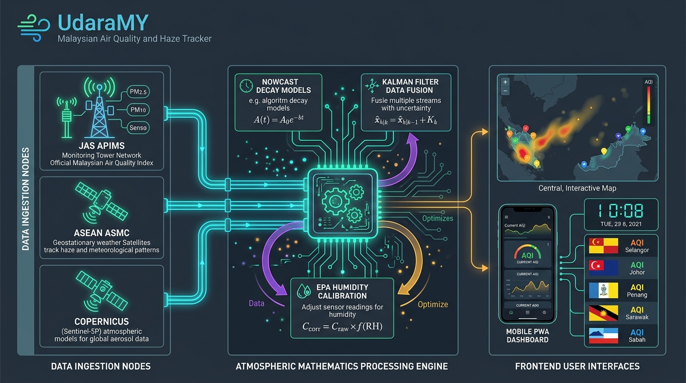

# UdaraMY — Malaysia Air Quality & Haze Tracker

<div align="center">


### Instantaneous, Hyper-Localized & Transboundary Air Quality Insights for Malaysia

[](https://vuejs.org/)
[](https://vitejs.dev/)
[](https://tailwindcss.com/)
[](https://leafletjs.com/)
[](https://web.dev/progressive-web-apps/)
[](LICENSE)

*Direct ingestion of official Department of Environment (DOE / JAS APIMS) telemetry, European Copernicus CAMS forecasts, and ASEAN ASMC satellite fire tracking with zero paywalls, zero accounts, and offline-first PWA caching.*

[Live Features](#-key-features) • [Atmospheric Mathematics](#-atmospheric-mathematics--predictive-engine) • [Architecture](#%EF%B8%8F-system-architecture) • [API Scale](#-air-pollutant-index-api--ipu-reference-scale) • [Getting Started](#-getting-started) • [Deployment](#-deployment)

</div>

---

## 🇲🇾 Overview

**UdaraMY** is a modern, privacy-respecting, high-performance Progressive Web Application (PWA) tailored specifically for everyday Malaysians, parents, schools, outdoor workers, and healthcare professionals.

Unlike worldwide weather apps that show delayed, model-interpolated AQI or require paid subscriptions, **UdaraMY directly connects to 100% official, real-time Malaysian DOE APIMS station data** and **ASEAN ASMC satellite hotspot feeds**. It translates technical chemical telemetry into immediate, practical Malaysian life decisions:
- *"Can my child attend school sports or recess today?"*
- *"Are schools closing in my district under official MOE rules (API > 200)?"*
- *"Should I dry laundry indoors or outdoors?"*
- *"Do I need to wear an N95 mask outside?"*
- *"Are transboundary smoke plumes from Sumatra or Kalimantan heading our way?"*

---

## ✨ Key Features

### 1. 📡 100% Official Real-Time APIMS Station Telemetry
- Real-time hourly API / IPU readings across all **68 official JAS DOE monitoring stations** spanning Peninsular Malaysia, Sabah, and Sarawak.
- **GPS Auto-Matching:** Instant Haversine geofencing pairs you with the nearest station and displays accurate distance in kilometers.
- Instant search and filtering by station name, district, or Malaysian region (Peninsular vs. Sabah & Sarawak).

### 2. 🗺️ Zoom-Adaptive National Map & Thermal Heatmap
- Full-screen interactive **Leaflet** map with dual tile modes: clean Positron cartography in Light Mode and AMOLED Dark Matter in Dark Mode.
- Custom **HTML5 Canvas radial thermal heat plumes** depicting atmospheric pollution dispersion across the country.
- **Dynamic Zoom Pins:** Clutter-free micro-dots at national view ($\le 6.5$), scaling smoothly to detailed badges at neighborhood view ($\ge 9.0$).

### 3. 🏁 Authentic Vector State Flags in Leaderboard
- Real-time ranking board featuring authentic vector SVG flags for all **13 Malaysian states and 3 Federal Territories** (`StateFlag.vue`).
- Filter and sort states by **Peak Station API**, **State Average API**, or **Alphabetical Name**.
- Instant 1-tap copy of state haze summary reports formatted for WhatsApp groups.

### 4. ☀️ Light Mode by Default + 1-Tap AMOLED Dark Mode
- Pristine, high-contrast **Light Mode as default**, with instant 1-tap switching to **Pure Black AMOLED (`#000000`) Dark Mode** to maximize battery life on OLED displays.
- Full theme synchronization across all card surfaces, dropdowns, and map layers with `localStorage` persistence.

### 5. 🕒 Live Ticking Clock & Atmospheric Telemetry Capsule
- Real-time digital clock displaying **Malaysia Time (MYT, UTC+8)** updated every second.
- Unified header capsule showing real-time APIMS synchronization status with pulsing live indicator.

### 6. 🔥 ASMC ASEAN Satellite Hotspot Tracking
- Daily satellite hotspot counts from the **ASEAN Specialised Meteorological Centre (ASMC)** covering:
  - **Sumatra** (Indonesia)
  - **Kalimantan** (Borneo)
  - **Peninsular Malaysia & Sabah/Sarawak**
- Real-time wind speed and wind direction telemetry powered by Open-Meteo, tracking transboundary smoke dispersion vectors.

### 7. 📈 48-Hour Predictive Diurnal Forecast & 24h Timelapse
- Dynamic 24-hour historical trend graph combined with a **48-hour forward-looking forecast** based on ECMWF Copernicus (CAMS) atmospheric models.
- **Interactive 24h Timelapse:** Animated playback scrubber illustrating hourly day-to-night air quality progression.

### 8. 🛡️ Persona-Specific Health Guidance & School Closure Alerts
- Tailored actionable guidance for 4 distinct vulnerability profiles:
  - 🏃 **Active & Cardio:** Running, cycling, and outdoor fitness exposure limits.
  - 🎒 **School & Kids:** Ministry of Education (KPM) recess suspension (API > 100) and mandatory school closure alerts (API > 200).
  - 🫁 **Sensitive Airways:** Preventative inhaler advisories and N95 / KF94 respirator timing.
  - 👵 **Seniors & Home:** Indoor air filtration, seal gaps, and cardiovascular precautions.

### 9. ❓ Built-In Air Quality FAQ & Educational Guide
- Comprehensive interactive accordion answering key questions:
  - *Which data is correct? OpenAQ vs DOE / JAS APIMS — which should I rely on?*
  - *Why does US AQI report a higher number than Malaysian API?*
  - *What is the US-EPA Tropical Humidity Correction Formula?*
  - *When do schools close during severe haze?*
  - *How frequently is data updated?*

### 10. 👨‍👩‍👧‍👦 Multi-Station Family Watchlist
- Pin multiple key stations (e.g. *Home, Office, Kids' School, Hometown / Kampung*).
- Persistent offline state saved directly in browser `localStorage`.
- Real-time color-coded micro-capsules for each pinned location.

### 11. 📲 Social Share Card Generator
- In-browser HTML5 Canvas snapshot generator creating styled cards for:
  - **Instagram Stories (9:16 vertical)**
  - **WhatsApp & Social Media (1:1 square)**

### 12. 📱 Offline-First Progressive Web App (PWA)
- Installable on iOS (Safari Add to Home Screen), Android (Chrome WebAPK), and Desktop.
- Automatic Workbox service worker caching allows the app to load and display cached air data even during network disruptions.

---

## 🧮 Atmospheric Mathematics & Predictive Engine

UdaraMY incorporates scientific equations and algorithms verified via automated unit testing (`npm test`):

### 1. Malaysian JAS APIMS Piecewise Conversion ($\text{PM}_{2.5} \leftrightarrow \text{API}$)
Calculates API from raw particulate concentrations based on the **Malaysian Ambient Air Quality Standard (MCG / IT-3)**:
$$\text{API} = I_{\text{low}} + \left(\frac{C - C_{\text{low}}}{C_{\text{high}} - C_{\text{low}}}\right) \times (I_{\text{high}} - I_{\text{low}})$$

### 2. US-EPA Tropical Humidity Correction Formula
Optical laser sensors (PurpleAir, Plantower) overestimate pollution in Southeast Asia due to hygroscopic swelling in high humidity ($>75\%$ RH). UdaraMY applies the **US-EPA Barkjohn et al.** calibration:
$$\text{Calibrated PM}_{2.5} = (0.524 \times \text{Raw PM}_{2.5}) - (0.0862 \times \text{RH}) + 5.75$$

### 3. US-EPA / WMO 12-Hour NowCast Decay Series
Eliminates 12-hour reporting lag during rapid smoke intrusions by weighting the most recent hours dynamically based on volatility ratio $\omega = \sqrt{c_{\min} / c_{\max}}$:
$$\text{NowCast} = \frac{\sum_{i=1}^{12} \omega^{i-1} \cdot C_i}{\sum_{i=1}^{12} \omega^{i-1}}$$

### 4. 1D Recursive Kalman Filter (Bayesian Data Fusion)
Fuses physical ground sensor readings ($z_k$) with atmospheric chemical transport forecast priors ($x_k^-$):
$$\text{Kalman Gain: } K = \frac{Q}{Q + R}, \quad \hat{x} = x_k^- + K(z_k - x_k^-), \quad P = (1 - K)Q$$

### 5. Haversine Great-Circle Geodesy
Computes great-circle distance between user GPS coordinates and all monitoring stations:
$$d = 2R \cdot \operatorname{atan2}\left(\sqrt{a}, \sqrt{1 - a}\right) \quad (R = 6,371\text{ km})$$

---

## 🏗️ System Architecture

<div align="center">
  
</div>


### Architectural Pipeline Breakdown:
1. **Data Ingestion Nodes**: Pulls 100% official telemetry from Department of Environment continuous monitoring towers (JAS APIMS), geostationary & polar weather satellites (ASEAN ASMC), European numerical aerosol transport models (Copernicus CAMS), and citizen micro-sensors (PurpleAir / OpenAQ).
2. **Gateway & Caching**: Vite proxy and Service Worker caching tier terminates SSL, bypasses CORS restrictions, and enforces a 15-minute in-memory cache to prevent server overload.
3. **Atmospheric Mathematics Processing Engine (`mathematicsService.js`)**: Runs 5 core mathematical transformations: piecewise linear standard interpolation, US-EPA tropical relative humidity calibration, WMO NowCast lag reduction decay, 1D recursive Kalman filtering for data fusion, and Haversine spherical geodesy.
4. **Frontend Client Interfaces**: Renders a zero-lag, reactive Vue 3 experience featuring dynamic zoom-adaptive Leaflet cartography, HTML5 Canvas radial thermal smoke plumes, 16 authentic vector state flags, and real-time school closure triggers under Malaysian Ministry of Education (KPM) guidelines.

---

## 📊 Air Pollutant Index (API / IPU) Reference Scale

UdaraMY strictly follows the official Malaysian Department of Environment (JAS) Air Pollutant Index rating system:

| API / IPU Range | Category | Color Status | Health Advisory Summary |
|:---:|:---:|:---:|:---|
| **0 – 50** | **Good (Baik)** | 🟢 Emerald | Air quality is satisfactory; enjoy outdoor sports freely. |
| **51 – 100** | **Moderate (Sederhana)** | 🟡 Amber | Acceptable air quality; sensitive individuals observe symptoms. |
| **101 – 200** | **Unhealthy (Tidak Sihat)** | 🟠 Orange | Sensitive groups wear N95 masks; outdoor school sports suspended. |
| **201 – 300** | **Very Unhealthy (Sangat Tidak Sihat)** | 🔴 Crimson | Avoid all outdoor activities; **mandatory school closure (MOE)**. |
| **> 300** | **Hazardous (Berbahaya)** | 🟣 Violet | Serious health hazard. Strictly stay indoors. Emergency declarations apply. |

---

## 💻 Tech Stack

- **Frontend Framework:** [Vue 3](https://vuejs.org/) (Composition API with `<script setup>`)
- **State Management:** [Pinia](https://pinia.vuejs.org/)
- **Build Tool:** [Vite 5](https://vitejs.dev/)
- **Styling:** [Tailwind CSS 3](https://tailwindcss.com/)
- **Mapping & GIS:** [Leaflet 1.9](https://leafletjs.com/) with responsive HTML5 Canvas heat plumes
- **Icons:** [Lucide Vue Next](https://lucide.dev/)
- **Internationalization:** [vue-i18n 9](https://vue-i18n.intlify.dev/)
- **Testing:** Node.js native test runner (`node --test`) with strict assertions
- **Offline & PWA:** [vite-plugin-pwa](https://vite-pwa-org.netlify.app/) (Workbox)

---

## 🚀 Getting Started

### Prerequisites
- [Node.js](https://nodejs.org/) (v18.0.0 or higher recommended)
- `npm` or `pnpm` or `yarn`

### Installation

1. **Clone the repository:**
   ```bash
   git clone git@github.com:saifulghazi-lang/UdaraMY.git
   cd UdaraMY
   ```

2. **Install dependencies:**
   ```bash
   npm install
   ```

3. **Start the local development server:**
   ```bash
   npm run dev
   ```
   The application will be available at `http://localhost:5173`.

4. **Run mathematical unit tests:**
   ```bash
   npm test
   # or: node --test src/services/__tests__/mathematicsService.test.js
   ```

5. **Build for production:**
   ```bash
   npm run build
   ```
   Production-ready static files and Service Worker assets will be compiled to the `dist/` directory.

6. **Preview production build locally:**
   ```bash
   npm run preview
   ```

---

## 🌐 Deployment

### Netlify
UdaraMY includes a pre-configured [`netlify.toml`](netlify.toml) and [`public/_redirects`](public/_redirects):
```bash
# Connect your GitHub repository to Netlify:
# Build Command: npm run build
# Publish Directory: dist
```

### Vercel
UdaraMY includes a pre-configured [`vercel.json`](vercel.json) with API proxy rewrites:
```bash
# Push to GitHub and import the project into Vercel.
# Framework Preset: Vite
# Output Directory: dist
```

---

## 📱 PWA Installation Guide

- **iOS (iPhone / iPad):** Open the site in Safari -> Tap the **Share** button -> Select **"Add to Home Screen"**.
- **Android (Chrome / Edge):** Open the site -> Tap the three-dot menu -> Select **"Install App"** or tap the install prompt.
- **Desktop (Chrome / Edge / Brave):** Click the **Install** icon in the address bar to run UdaraMY as a standalone desktop window.

---

## 🤝 Data Sources & Acknowledgments

- **Department of Environment Malaysia (Jabatan Alam Sekitar / JAS):** Real-time Air Pollutant Index Management System ([APIMS](https://apims.doe.gov.my/)).
- **ASEAN Specialised Meteorological Centre (ASMC):** Daily satellite hotspot tracking and transboundary haze monitoring ([ASMC](https://asmc.asean.org/)).
- **European Copernicus Atmosphere Monitoring Service (CAMS):** Multi-pollutant global numerical forecasts via [Open-Meteo](https://open-meteo.com/).
- **United States Environmental Protection Agency (US-EPA):** Low-cost sensor humidity calibration & NowCast methodology ([AirNow](https://www.airnow.gov/)).

*Disclaimer: UdaraMY is an open-source civic technology initiative designed for public awareness and community health empowerment. For official emergency declarations and school closures, always consult announcements from the Malaysian Ministry of Education (KPM), the Department of Environment (JAS), and the National Disaster Management Agency (NADMA).*

---

## 📄 License

This project is licensed under the [MIT License](LICENSE).
