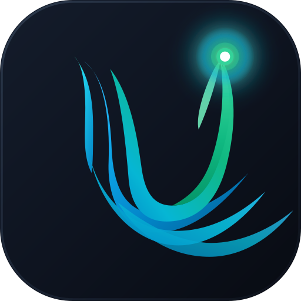

# UdaraMY — Malaysia Air Quality & Haze Tracker

<div align="center">



### Instantaneous, Hyper-Localized & Transboundary Air Quality Insights for Malaysia

[](https://vuejs.org/)
[](https://vitejs.dev/)
[](https://tailwindcss.com/)
[](https://leafletjs.com/)
[](https://web.dev/progressive-web-apps/)
[](LICENSE)

*Direct ingestion of official Department of Environment (DOE / JAS APIMS) telemetry and ASEAN ASMC satellite fire tracking with zero paywalls, zero accounts, and offline-first PWA caching.*

[Live Features](#-key-features) • [System Architecture](#%EF%B8%8F-system-architecture) • [API Scale](#-air-pollutant-index-api--ipu-reference-scale) • [Getting Started](#-getting-started) • [Deployment](#-deployment)

</div>

---

## 🇲🇾 Overview

**UdaraMY** is a modern, privacy-respecting, high-performance Progressive Web Application (PWA) tailored specifically for everyday Malaysians, parents, schools, outdoor workers, and healthcare professionals.

Unlike worldwide weather apps that show delayed, model-interpolated AQI or require paid subscriptions, **UdaraMY directly connects to 100% official, real-time Malaysian DOE APIMS station data** and **ASEAN ASMC satellite hotspot feeds**. It translates technical chemical telemetry into immediate, practical Malaysian life decisions:
- *"Can my child attend school sports today?"*
- *"Should I dry laundry indoors or outdoors?"*
- *"Do I need to wear an N95 mask outside?"*
- *"Are transboundary smoke plumes from Sumatra or Kalimantan heading our way?"*

---

## ✨ Key Features

### 1. 📡 100% Official Real-Time APIMS Station Telemetry
- Real-time hourly API / IPU readings across all **68 official JAS DOE monitoring stations** spanning Peninsular Malaysia, Sabah, and Sarawak.
- **GPS Auto-Matching:** Instant Haversine geofencing pairs you with the nearest station and displays accurate distance in kilometers.
- Instant search and filtering by station name, district, or Malaysian state.

### 2. 🗺️ National Map with Live Canvas Heatmap Plumes
- Full-screen interactive **Leaflet** map powered by CartoDB Dark Matter tiles.
- Custom **HTML5 Canvas radial thermal heat plumes** depicting atmospheric pollution dispersion across the country.
- Dual station markers showing official JAS ground stations alongside community sensor overlays.

### 3. 🔥 ASMC ASEAN Satellite Hotspot Tracking & Haze Trajectories
- Live daily satellite hotspot counts from the **ASEAN Specialised Meteorological Centre (ASMC)** covering:
  - **Sumatra** (Indonesia)
  - **Kalimantan** (Borneo)
  - **Peninsular Malaysia & Sabah/Sarawak**
- Real-time wind speed and wind direction telemetry powered by Open-Meteo, calculating 3-hour transboundary smoke dispersion vectors.

### 4. 📈 48-Hour Predictive Diurnal Trend Forecast
- Dynamic 24-hour historical trend graph combined with a **48-hour forward-looking forecast** based on diurnal temperature inversion and wind dispersal modeling.
- Clear peak-hour indicators for early morning commute haze and late afternoon clearing.

### 5. 👨‍👩‍👧‍👦 Multi-Station Family Watchlist
- Pin multiple key stations (e.g. *Home, Office, Kids' School, Hometown / Kampung*).
- Persistent offline state saved directly in browser `localStorage`.
- Real-time color-coded badge indicators for each pinned location.

### 6. 🛡️ Persona-Specific Health Guidance
- Tailored actionable guidance for 4 distinct Malaysian vulnerability profiles:
  - 🎒 **Children & Toddlers:** Recess advisories, classroom ventilation, outdoor sports suspension.
  - 🫁 **Asthma & Respiratory:** Preventative inhaler recommendations, N95 mask timings.
  - 🧓 **Elderly & Seniors:** Cardiovascular precautions, indoor air filtration tips.
  - 🛵 **Outdoor & Gig Workers:** Delivery rider exposure limits, hydration, and respirator guidance.

### 7. 📅 365-Day Annual Haze Seasonality Heatmap Grid
- Interactive annual calendar grid visualizing historical haze seasonality patterns (highlighting the Southwest Monsoon peak haze months of August–October).

### 8. 📲 Viral Social Share Card Generator
- In-browser HTML5 Canvas snapshot generator creating styled cards for:
  - **Instagram Stories (9:16 vertical)**
  - **WhatsApp & Social Media (1:1 square)**
- Share real-time local haze updates to family WhatsApp groups with one click.

### 9. 🌐 Bilingual & AMOLED Pure Black UI
- Full bilingual localization: **Bahasa Melayu** and **English**.
- True **AMOLED pure black (`#000000`)** design system with luminous atmospheric status accents (Cyan, Emerald, Amber, Crimson, Violet) to maximize battery life on OLED displays.

### 10. 📱 Offline-First Progressive Web App (PWA)
- Installable on iOS (Safari Add to Home Screen) and Android (Chrome WebAPK).
- Automatic Workbox service worker caching allows the app to load and display cached air data even during network disruptions.

---

## 🏗️ System Architecture

```
┌─────────────────────────────────────────────────────────────────┐
│                           UdaraMY PWA                           │
│     (Vue 3 Composition API + Pinia Store + Tailwind CSS)        │
└───────┬─────────────────────────┬─────────────────────────┬─────┘
        │                         │                         │
        ▼                         ▼                         ▼
┌──────────────┐          ┌──────────────┐          ┌──────────────┐
│  JAS APIMS   │          │  ASMC ASEAN  │          │  Open-Meteo  │
│  Live Feed   │          │  Satellites  │          │  Wind Vector │
│  (68 Stns)   │          │  (Hotspots)  │          │  (Telemetry) │
└───────┬──────┘          └───────┬──────┘          └───────┬──────┘
        │                         │                         │
        └────────────────► Vite Proxy ◄─────────────────────┘
                                  │
                                  ▼
                   ┌──────────────────────────────┐
                   │  Atmospheric Card & Map UI   │
                   │  - Geolocation Match         │
                   │  - Radial Thermal Plumes     │
                   │  - 48h Diurnal Forecast      │
                   │  - Health Persona Advisory   │
                   └──────────────────────────────┘
```

---

## 📊 Air Pollutant Index (API / IPU) Reference Scale

UdaraMY strictly follows the official Malaysian Department of Environment (JAS) Air Pollutant Index rating system:

| API / IPU Range | Category | Color Status | Health Advisory Summary |
|:---:|:---:|:---:|:---|
| **0 – 50** | **Good (Baik)** | 🟢 Emerald | Air quality is satisfactory; enjoy outdoor sports freely. |
| **51 – 100** | **Moderate (Sederhana)** | 🟡 Amber | Acceptable air quality; sensitive individuals observe symptoms. |
| **101 – 200** | **Unhealthy (Tidak Sihat)** | 🟠 Orange | Sensitive groups wear N95 masks; reduce vigorous outdoor exertion. |
| **201 – 300** | **Very Unhealthy (Sangat Tidak Sihat)** | 🔴 Crimson | Avoid all outdoor activities; close windows and run air purifiers. |
| **> 300** | **Hazardous (Berbahaya)** | 🟣 Violet | Serious health hazard. Strictly stay indoors. Official crisis guidelines apply. |

---

## 💻 Tech Stack

- **Frontend Framework:** [Vue 3](https://vuejs.org/) (Composition API with `<script setup>`)
- **State Management:** [Pinia](https://pinia.vuejs.org/)
- **Build Tool:** [Vite 5](https://vitejs.dev/)
- **Styling:** [Tailwind CSS 3](https://tailwindcss.com/)
- **Mapping & GIS:** [Leaflet 1.9](https://leafletjs.com/) with custom Canvas thermal plume overlays
- **Icons:** [Lucide Vue Next](https://lucide.dev/)
- **Internationalization:** [vue-i18n 9](https://vue-i18n.intlify.dev/) (Bahasa Melayu & English)
- **Offline & PWA:** [vite-plugin-pwa](https://vite-pwa-org.netlify.app/) (Workbox)

---

## 🚀 Getting Started

### Prerequisites
- [Node.js](https://nodejs.org/) (v18.0.0 or higher recommended)
- `npm` or `pnpm` or `yarn`

### Installation

1. **Clone the repository:**
   ```bash
   git clone git@github.com:saifulghazi-lang/UdaraMY.git
   cd UdaraMY
   ```

2. **Install dependencies:**
   ```bash
   npm install
   ```

3. **Start the local development server:**
   ```bash
   npm run dev
   ```
   The application will be available at `http://localhost:5173`.

4. **Build for production:**
   ```bash
   npm run build
   ```
   Production-ready static files and Service Worker assets will be compiled to the `dist/` directory.

5. **Preview production build locally:**
   ```bash
   npm run preview
   ```

---

## 🌐 Deployment

### Netlify
UdaraMY includes a pre-configured [`netlify.toml`](netlify.toml) and [`public/_redirects`](public/_redirects):
```bash
# Connect your GitHub repository to Netlify:
# Build Command: npm run build
# Publish Directory: dist
```

### Vercel
UdaraMY includes a pre-configured [`vercel.json`](vercel.json) with API proxy rewrites:
```bash
# Push to GitHub and import the project into Vercel.
# Framework Preset: Vite
# Output Directory: dist
```

---

## 📱 PWA Installation Guide

- **iOS (iPhone / iPad):** Open the site in Safari -> Tap the **Share** button -> Select **"Add to Home Screen"**.
- **Android (Chrome / Edge):** Open the site -> Tap the three-dot menu -> Select **"Install App"** or tap the install prompt.
- **Desktop (Chrome / Edge / Brave):** Click the **Install** icon in the address bar to run UdaraMY as a standalone desktop window.

---

## 🤝 Data Sources & Acknowledgments

- **Department of Environment Malaysia (Jabatan Alam Sekitar / JAS):** Real-time Air Pollutant Index Management System ([APIMS](https://apims.doe.gov.my/)).
- **ASEAN Specialised Meteorological Centre (ASMC):** Daily satellite hotspot tracking and transboundary haze monitoring ([ASMC](https://asmc.asean.org/)).
- **Open-Meteo:** Open-source weather and wind vector API ([Open-Meteo](https://open-meteo.com/)).

*Disclaimer: UdaraMY is an open-source civic technology initiative designed for public awareness and community health empowerment. For official emergency declarations and school closures, always consult announcements from the Malaysian Ministry of Education (KPM) and the Department of Environment (JAS).*

---

## 📄 License

This project is licensed under the [MIT License](LICENSE).
